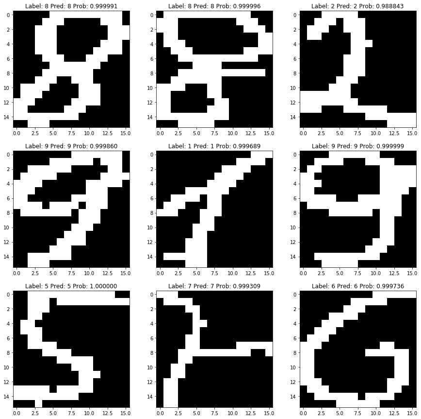

# Semeion Handwritten Digit Classifier using CNN

# Dataset

- [UCI Machine Learning Repository: Semeion Handwritten Digit Data Set](https://archive.ics.uci.edu/ml/datasets/semeion+handwritten+digit)
- 1593 handwritten digits from around 80 persons were scanned, stretched in a rectangular box 16x16 in a gray scale of 256 values.Then each pixel of each image was scaled into a bolean (1/0) value using a fixed threshold. 
- Each person wrote on a paper all the digits from 0 to 9, twice. The commitment was to write the digit the first time in the normal way (trying to write each digit accurately) and the second time in a fast way (with no accuracy). 

# Convolutional Neural Network (CNN)

- Train a simple CNN classifier to classify digits, perform validation and test evaluation
- Demonstration of Manual k-Fold cross validation
- Plot the Model Accuracy and Model Loss (One validation set)

# Results

- Average accuracy of 97.17% was achieved using 10 fold cross validation with standard deviation 0.98%

|**Accuracy**|
|:---:|
|97.56%|
|98.76%|
|96.25%|
|98.12%|
|96.88%|
|96.86%|
|98.11%|
|97.48%|
|96.18%|
|95.45%|
|Avg: 97.17%|
|SD: +/-0.98%|

## 9 random samples: Real labels, predicted labels and probabilities

